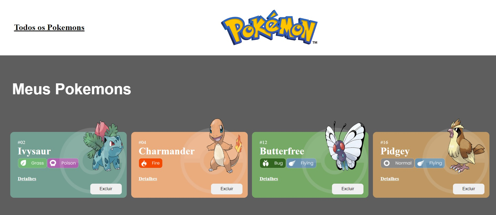
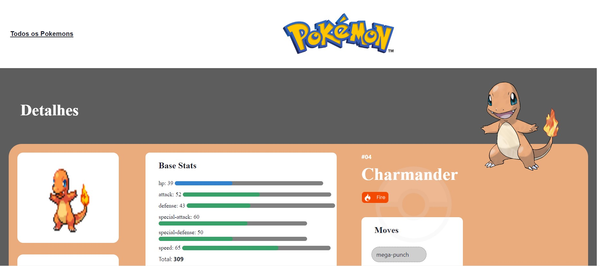

# PROJETO POKEDEX

## DESCRIÇÃO DO PROJETO
O objetivo do projeto foi criar um site de pokedex que  é uma enciclopédia virtual que detém todas as espécies de pokémon. Sendo possivel acessar os detalhes dos pokemons, caso você goste de um pokemon, também disponibilizamos o recurso de captura o pokemon para uma futura batalha.

# 
## TECNOLOGIAS UTILIZADAS
- React
- Chakra UI
- Styled Components
- Poké API
- Axios
- React Routes
- React Hooks
- Global State
#
## FUNCIONALIDADES DO PROJETO
[X] Acessar detalhes de cada pokémon

[X] Capturar o pokémon

[X] Acessar página "Meus pokémons"

[X]Excluir pokémon da página "Meus pokémons"

[X]Retornar a página inicial
#
## LAYOUT

- HOME

- POKEDEX

- DETALHES

#
## LINK

https://pokemon-projeto-react.vercel.app/
